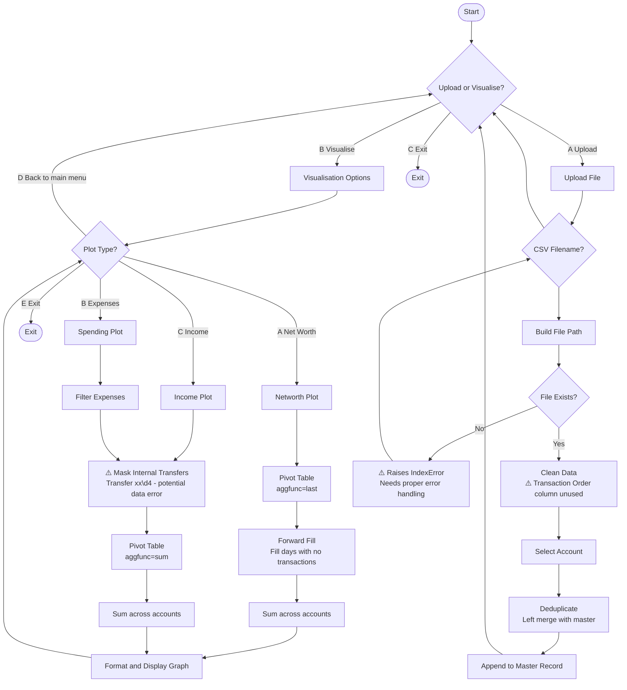

# Financial Data Tracker 

## Requirements
- Python 3.13.13
- CSV export from your bank

## Installation

1. Clone the repository
2. Install dependencies
```
pip install -r requirements.txt
```
## Usage

1. Place your CSV export in the Data folder
2. Run the program with python main.py
3. Follow the prompts to upload or visaulise

## Data Format

Your CSV export should have the following columns in this order:
Date,Amount,Desc,Balance
25/12/2020,-15.00,Coles,1000.00



## The Problem

I need a finnacial tracker that can manage multiple accounts and account types in order to be able to visualise the complete picture of my finnances  historically, currently and there forecast in one program.

## Solution

Key reasons other methods have failed:
* Manual input of every transaction required
* Manual Categorisation even on repeats
* Lacks finnacial picture across accounts
* Lacks a historical context and future forecast

Key techniques aimmed to boost long term success chance
* Historical context highlights improvements and changes in spending 
* Future forecasts make the ability to achieve goals crystal clear
* Reduction of friction of use by limiting manual input needed done via
    * Autocategorisation where possible
    * Transaction input being a downloaded CSV
    * Tracking all accounts shows the full picture

## The Plan

Key Stages:

### Stage 1 (Reordered):
The basic program
* 1 Basic shell i/o that takes CSV from my main account store it to a master document, cleans data to ensure no repeats or invalid data
* 1.2 Add the ability to use multiple accounts *(Developed before 1.1 as multi-account support was required for meaningful visualisation)*
* 1.1 Track and visualises networth, spending and income *(Developed After 1.2)*

### Stage 2:
Machine learning / artifical intelligence categorisation
* 2 Train a model in order to categorise transactions automatically if confidence score is below X% flag for manual review, if confidence score is below X% do not categorise and ask for manual review
* 2.1 Use new categories to increase data visualisation details 

## Skills 

Python
Pandas
ML Model building and training
Matplotlib
Git
<<<<<<< Updated upstream
=======

## Feature Ideas

* Option to delete the File after uploading it
* Link to commbank directly via API
>>>>>>> Stashed changes
